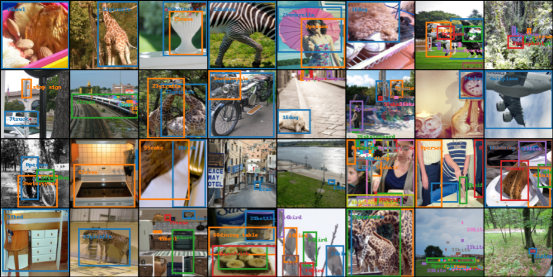
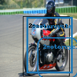
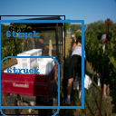

This codebase is a modified version of the **Single Shot multibox object Detector** [pytorch codebase](https://github.com/amdegroot/ssd.pytorch), which is an implementation of the [Single Shot MultiBox Detector](http://arxiv.org/abs/1512.02325) from the 2016 paper by Liu et al.
The modifications mainly include the following:
- Adapting SSD and Ground Truth (GT) generation to train:
  - datasets of different image sizes (tested for 64x64, 128x128, 256x256 RGB images).
  - for detecting only a few specified classes in the dataset (some more settings can be configured in [ssd.py](ssd.py)).
- Adding functionality to visualize dataset preprocessing and augmentations.
- Simplifying model evaluation both visually (predicted and GT bounding boxes) and through the Precision-Recall graphs and mAP (mean Average Precision) metrics.

Currently, the codebase includes implementation of only MS-COCO dataset, but given the modular structure can be easily extended to other datasets.

## Datasets overview
To get dataset summary and view sample image crops with bounding boxes and class labels+names for a supported dataset, run `python3 -m data.<dataset_name>`. 
Generated image collages are in /tmp folder ([relevant implementation in codebase](data/coco/coco.py)). Example images:
    <h4 align="center"> All dataset classes images collage </h4>
    
    <h4 align="center"> Only zebra person and airplane classes images collage </h4>
    

## Training
Run `python3 train.py --dataset=COCO --image_size=64 --dataset_subcategory=TRAFFIC --test_run`. 
The loss, accuracy, per class mAP (mean Average Precision) and Precison-Recall (PR) curves, and images with GT and predictions are saved as files or can viewed from the tensorboard summaries in *COCO_{image_size}x{image_size}/rundate/runtime* subdirectory in *./experiments* or */tmp* depending on --test_run flag.

## Evaluation
To test a model both through images and the PR curves and mAPs, run `python3 test.py <model_path> --dataset=COCO --image_size=128 --dataset_subcategory=TRAFFIC --test_run`. The results of the evaluation are in ./evals/rundate_runtime.

## Debugging
Will soon add script to debug images. For e.g., the images below show 3 bounding boxes:
- the black box shows the GT for the correct class (bus, motorcycle and truck in the images below)
- the rounded corners blue box is the prior with the most confident predicted for thr correct class
- the blue box with 90deg corners is the final predicted bounding box by the SSD (obtained by decoding the predicted offsets for the drawn prior box). 
  
